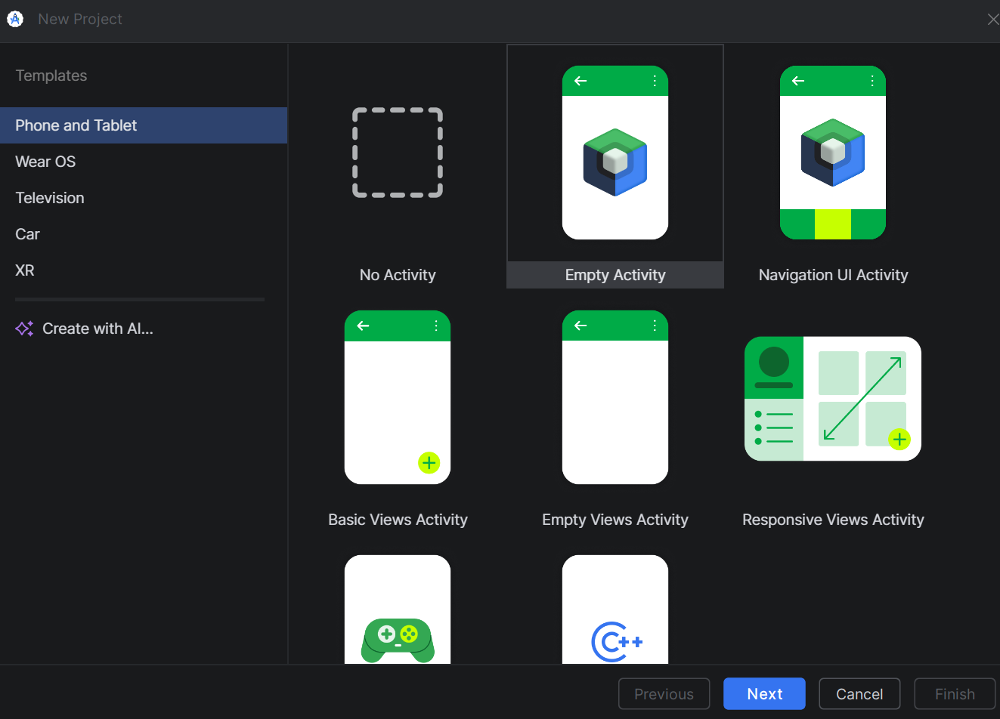
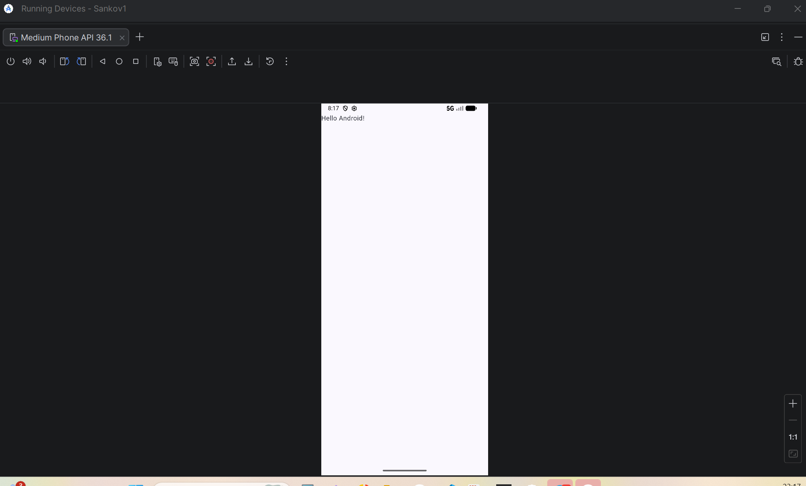
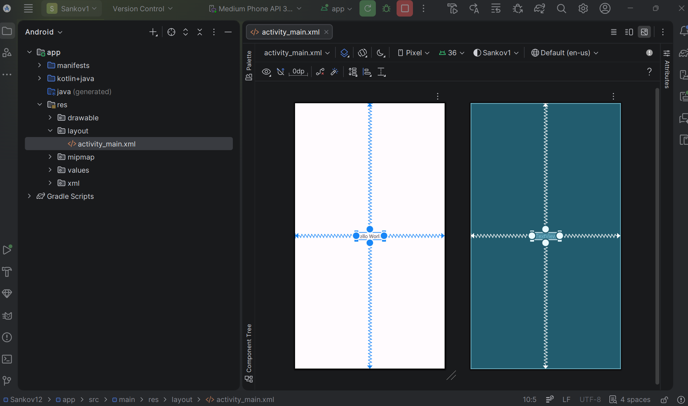

# Практическая работа №3: Обработка событий клика

**Выполнил:**  
Саньков Андрей Александрович  
Группа: ИНС-б-о-24-1  


---

## Цель работы

Изучить механизм обработки событий в Android. Научиться обрабатывать нажатия на элементы интерфейса (кнопки) с помощью декларативного подхода (XML) и программного подхода (Java). Освоить работу с идентификаторами ресурсов и Toast-уведомлениями.

---

## Ход работы

### Задание 1. Создание проекта и верстка экрана

Создан новый проект с шаблоном Empty Views Activity. В файле `activity_main.xml` размещена кнопка с параметрами: `android:id="@+id/button1"`, ширина 175dp, высота 75dp, текст «Кнопка».


**Рисунок 1** — Разметка с одной кнопкой

---

### Задание 2. Обработка клика через XML-атрибут onClick

В XML кнопке добавлен атрибут `android:onClick="onButtonClick"`. В `MainActivity.java` создан метод `onButtonClick(View view)`, выводящий Toast с фамилией студента.



**Рисунок 2** — Всплывающее сообщение при клике

---

### Задание 3. Обработка клика через setOnClickListener

Атрибут `android:onClick` удалён. В методе `onCreate` получена ссылка на кнопку и установлен слушатель `setOnClickListener`, который выводит Toast.


**Рисунок 3** — Код с setOnClickListener

---

### Задание 4. Использование аргумента View для изменения кнопки

В обработчике клика текст нажатой кнопки изменён на «Нажата!» с помощью приведения параметра `v` к типу `Button`.


**Рисунок 4** — Кнопка после нажатия

---

### Задание 5. Работа с несколькими кнопками

Добавлены ещё две кнопки (всего три). Для каждой назначен свой слушатель. При нажатии на любую кнопку отображается Toast с указанием, какая именно кнопка нажата.


**Рисунок 5** — Три кнопки с разными обработчиками

---

## Задания для самостоятельного выполнения

### 1. Фамилия при клике

Модифицировано приложение из задания 2. При нажатии на кнопку выводится Toast с фамилией и инициалами.



**Рисунок 6** — Вывод фамилии

---

### 2. Изменение текста кнопки

Добавлена вторая кнопка. При нажатии на неё текст на этой же кнопке меняется на фамилию студента.



**Рисунок 7** — Кнопка после нажатия

---

### 3. Три кнопки и три события

Созданы три кнопки. Для каждой назначен отдельный слушатель. При нажатии на любую из кнопок Toast выводит фамилию с указанием номера нажатой кнопки.


**Рисунок 8** — Пример сообщения для кнопки 1

---

### 4. Три кнопки и один слушатель

Использован один общий объект-слушатель. Внутри него идентификация нажатой кнопки осуществляется через `v.getId()`.


**Рисунок 9** — Общий слушатель с проверкой id

---

### 5. Переключение реакции

Создано приложение с двумя кнопками. Нажатие на первую кнопку включает «режим А» (Toast с фамилией при повторном нажатии на первую кнопку). Нажатие на вторую кнопку переключает в «режим Б» (Toast с номером группы). Использована переменная-флаг.


**Рисунок 10** — Демонстрация режима А

---

## Контрольные вопросы

### 1. Что такое ViewBinding и в чем его преимущество перед классическим методом findViewById()? (Кратко опишите, как его подключить).

**ViewBinding** — это механизм, генерирующий класс-привязку для каждого XML-файла разметки. В этом классе содержатся прямые ссылки на все View с id. Преимущества: отсутствие необходимости писать `findViewById()`, типобезопасность (нет приведения типов), защита от null. Для подключения нужно добавить в `build.gradle` (модуль) `buildFeatures { viewBinding true }`. Затем в Activity использовать `ActivityMainBinding.inflate(getLayoutInflater())` и `setContentView(binding.getRoot())`. Доступ к View — через поля `binding`.

---

### 2. В чем разница между декларативной (XML-атрибут onClick) и программной (setOnClickListener) подпиской на событие? Когда какой способ предпочтительнее?

Декларативный способ: обработчик указывается в XML, метод должен быть `public void` с параметром `View`. Программный: слушатель устанавливается в Java-коде.  
Разница: декларативный подход проще для простых действий, но метод должен существовать в Activity. Программный даёт больше гибкости (можно назначать слушатели динамически, использовать анонимные классы, лямбды). Предпочтительнее: декларативный — для простых фиксированных действий; программный — когда логика сложная, зависит от состояния или требуется переиспользование.

---

### 3. Что произойдет, если в методе-обработчике, указанном в XML, изменить сигнатуру (например, убрать параметр View v)? Почему?

Приложение вызовет исключение (обычно `IllegalStateException` или `NoSuchMethodException`), так как система ищет метод с точной сигнатурой: `public void onButtonClick(View view)`. Если сигнатура не совпадает, система не сможет вызвать обработчик, и приложение упадёт при попытке нажать на кнопку.

---

### 4. Опишите жизненный цикл Activity. В каком методе (onCreate, onStart, onResume) лучше всего инициализировать слушатели для кнопок и почему?

Жизненный цикл Activity: `onCreate()` → `onStart()` → `onResume()` → (работа) → `onPause()` → `onStop()` → `onDestroy()`.  
Инициализировать слушатели лучше всего в `onCreate()`, потому что:
- `onCreate()` вызывается один раз за всё время существования Activity.
- К моменту `onCreate()` разметка уже загружена (`setContentView()`), и можно безопасно получать ссылки на View.
- Это гарантирует, что слушатели будут установлены до того, как Activity станет видимой (`onStart`, `onResume`).

---

### 5. Что такое анонимный внутренний класс? Как он используется при установке слушателей событий в Java?

Анонимный внутренний класс — это класс без имени, объявленный и создаваемый одновременно. Он используется для создания одноразовых реализаций интерфейсов.  
При установке слушателя событий часто пишут:
```java
button.setOnClickListener(new View.OnClickListener() {
    @Override
    public void onClick(View v) {
        // обработка
    }
});
