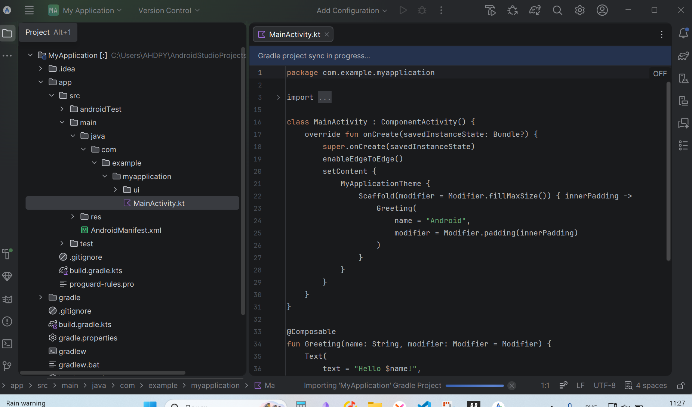
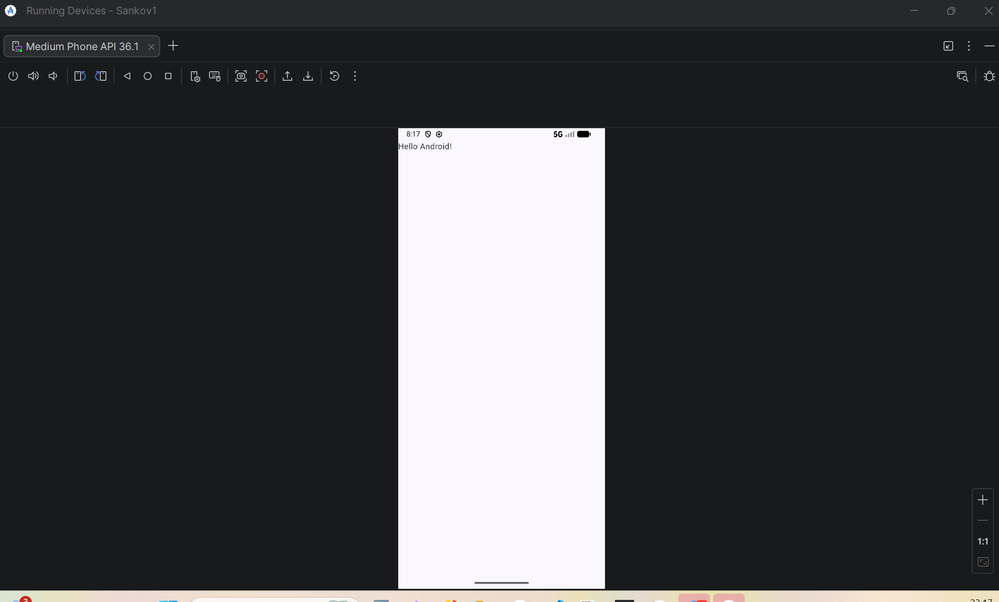

# Практическая работа №12: Типы активностей. Шаблоны Android Studio. Сохранение настроек с SharedPreferences

**Выполнил:**  
Саньков Андрей Александрович  
Группа: ИНС-б-о-24-1  
Направление: 09.03.02 «Информационные системы и технологии»

---

## Цель работы

Изучить различные типы шаблонов активностей, предоставляемых Android Studio. Научиться создавать многоэкранные приложения с использованием разных видов окон. Освоить механизм сохранения простых пользовательских настроек с помощью SharedPreferences.

---

## Ход работы

### Задание 1. Создание проекта и подготовка

Создан новый проект MultiWindowApp с пустой активностью.


**Рисунок 1** — Создание проекта

### Задание 2. Добавление активностей по шаблонам
Создадим три активности:

SettingsActivity (шаблон Settings Activity) — экран настроек.

GameActivity (Empty Activity) — экран игры.

RecordsActivity (Empty Activity) — экран рекордов.

### 2.1 SettingsActivity
SettingsActivity — создана с использованием шаблона Settings Activity.
Автоматически сгенерированы файлы: класс SettingsActivity, разметка activity_settings.xml и файл настроек res/xml/root_preferences.xml.
Настройки будут сохраняться в SharedPreferences с именем файла по умолчанию.

Файл настроек res/xml/root_preferences.xml:

```xml
<PreferenceScreen xmlns:app="http://schemas.android.com/apk/res-auto">
    <EditTextPreference
        app:key="player_name"
        app:title="Имя игрока"
        app:summary="Введите ваше имя"
        app:useSimpleSummaryProvider="true" />
    <ListPreference
        app:key="difficulty"
        app:title="Сложность"
        app:summary="Выберите уровень сложности"
        app:entries="@array/difficulty_entries"
        app:entryValues="@array/difficulty_values"
        app:defaultValue="medium"
        app:useSimpleSummaryProvider="true" />
    <SwitchPreference
        app:key="sound_enabled"
        app:title="Звук"
        app:summary="Включить звуковые эффекты"
        app:defaultValue="true" />
</PreferenceScreen>
```


**Рисунок 2** —  Создание класс SettingsActivity

### 2.2 GameActivity
GameActivity — создана по шаблону Empty Views Activity.
На экране будет размещён игровой процесс (пока заглушка с текстом «Здесь будет игра Сапёр»)


**Рисунок 3** —  Создание класс GameActivity

### 2.3 - RecordsActivity
RecordsActivity — также по шаблону Empty Views Activity.
Предназначена для отображения рекордов (заглушка «Рекорды пока отсутствуют»).


**Рисунок 4** —  Создание класс RecordsActivity

### Задание 3. Настройка переходов между окнами
На главном экране (MainActivity) созданы три кнопки для навигации между активностями: «Новая игра», «Настройки», «Рекорды».
В классе MainActivity реализованы обработчики, открывающие соответствующие экраны через Intent:

GameActivity – для перехода к игровому полю,

SettingsActivity – для открытия настроек,

RecordsActivity – для просмотра рекордов.

Все переходы работают корректно, многоэкранное приложение функционирует.
Разметка activity_main.xml:


**Рисунок 5** —  Настройка переходов между окнами

```xml
<LinearLayout xmlns:android="http://schemas.android.com/apk/res/android"
    android:layout_width="match_parent"
    android:layout_height="match_parent"
    android:orientation="vertical"
    android:gravity="center"
    android:padding="16dp">

    <Button
        android:id="@+id/btnGame"
        android:layout_width="wrap_content"
        android:layout_height="wrap_content"
        android:text="Новая игра"
        android:layout_marginBottom="16dp" />

    <Button
        android:id="@+id/btnSettings"
        android:layout_width="wrap_content"
        android:layout_height="wrap_content"
        android:text="Настройки"
        android:layout_marginBottom="16dp" />

    <Button
        android:id="@+id/btnRecords"
        android:layout_width="wrap_content"
        android:layout_height="wrap_content"
        android:text="Рекорды" />

</LinearLayout>
```
Обработчики переходов в MainActivity.java:

```java
package com.example.multiwindowapp;

import android.content.Intent;
import android.os.Bundle;
import android.widget.Button;
import androidx.appcompat.app.AppCompatActivity;

public class MainActivity extends AppCompatActivity {

    @Override
    protected void onCreate(Bundle savedInstanceState) {
        super.onCreate(savedInstanceState);
        setContentView(R.layout.activity_main);

        Button btnGame = findViewById(R.id.btnGame);
        Button btnSettings = findViewById(R.id.btnSettings);
        Button btnRecords = findViewById(R.id.btnRecords);

        btnGame.setOnClickListener(v -> {
            startActivity(new Intent(MainActivity.this, GameActivity.class));
        });

        btnSettings.setOnClickListener(v -> {
            startActivity(new Intent(MainActivity.this, SettingsActivity.class));
        });

        btnRecords.setOnClickListener(v -> {
            startActivity(new Intent(MainActivity.this, RecordsActivity.class));
        });
    }
}
```

### Задание 4. Работа с SharedPreferences
1) Реализовано сохранение и отображение пользовательских настроек с помощью SharedPreferences. Настроено единое имя файла настроек (com.example.multiwindowapp_preferences) для всех компонентов приложения.

2) Главный экран дополнен текстовым полем и кнопкой «Обновить настройки». При запуске и по нажатию кнопки считываются из SharedPreferences имя игрока, сложность и статус звука, после чего отображаются в читаемом виде.

3) Экран настроек (SettingsActivity) использует PreferenceFragmentCompat с явно заданным именем файла SharedPreferences через getPreferenceManager().setSharedPreferencesName(). Это гарантирует, что все изменения сохраняются в том же файле, откуда читают другие экраны.

4) Экран игры (GameActivity) имитирует завершение игрового процесса, генерирует случайное время и сохраняет лучший результат (рекорд) в SharedPreferences под ключом best_time. При обновлении рекорда выводится уведомление.

5) Экран рекордов (RecordsActivity) читает значение best_time из SharedPreferences и показывает лучший результат или сообщение об отсутствии рекорда.

6) Все три параметра настроек (имя, сложность, звук) и рекорд сохраняются между запусками приложения.


**Рисунок 6** —  Работа с SharedPreferences
Чтение и отображение настроек в MainActivity:

```java
private void loadSettings() {
    SharedPreferences prefs = getSharedPreferences("com.example.multiwindowapp_preferences", MODE_PRIVATE);
    String playerName = prefs.getString("player_name", "Не указано");
    String difficulty = prefs.getString("difficulty", "medium");
    boolean soundEnabled = prefs.getBoolean("sound_enabled", true);
    // ... преобразование и отображение
}
```
Сохранение рекорда в GameActivity:

```java
SharedPreferences prefs = getSharedPreferences("com.example.multiwindowapp_preferences", MODE_PRIVATE);
int bestTime = prefs.getInt("best_time", Integer.MAX_VALUE);
if (time < bestTime) {
    prefs.edit().putInt("best_time", time).apply();
    Toast.makeText(this, "Новый рекорд: " + time + " сек!", Toast.LENGTH_SHORT).show();
}
```
Отображение рекорда в RecordsActivity:

```java
int bestTime = prefs.getInt("best_time", -1);
if (bestTime == -1) {
    tvRecords.setText("Рекордов пока нет");
} else {
    tvRecords.setText("Лучшее время: " + bestTime + " секунд");
}
```
## Контрольные вопросы
### 1. Какие шаблоны активностей предоставляет Android Studio? Кратко опишите назначение 3-4 из них.

Android Studio предлагает множество шаблонов для быстрого создания активностей, среди которых:

Empty Activity – пустая активность с минимальной разметкой, используется как основа для любого экрана.

Basic Activity – включает панель действий (AppBar/Toolbar) и плавающую кнопку действия (FloatingActionButton), подходит для стандартных экранов приложения.

Settings Activity – готовая активность для экрана настроек, использующая PreferenceFragmentCompat; настройки автоматически сохраняются в SharedPreferences.

Navigation Drawer Activity – активность с боковым выдвижным меню (DrawerLayout), удобна для навигации между разделами приложения.

### 2. Для чего используется SharedPreferences? Какие типы данных можно в нём хранить?

SharedPreferences предназначен для сохранения небольших объемов простых данных в виде пар «ключ-значение» во внутреннем хранилище приложения. Данные сохраняются между запусками.
Поддерживаются примитивные типы: String, int, long, float, boolean, а также Set<String>.

### 3. В чём разница между методами getPreferences(), getSharedPreferences() и PreferenceManager.getDefaultSharedPreferences()?

getPreferences(int mode) – возвращает объект SharedPreferences, привязанный только к данной активности (имя файла совпадает с именем класса активности).

getSharedPreferences(String name, int mode) – возвращает общие для всего приложения настройки с указанным именем файла. Позволяет обращаться к одному и тому же файлу из разных компонентов.

PreferenceManager.getDefaultSharedPreferences(Context context) – возвращает настройки с именем по умолчанию (обычно <package_name>_preferences), используемые стандартным экраном настроек (Settings Activity). Это удобный способ получить те же настройки, что и экран с PreferenceFragmentCompat.

### 4. Как записать данные в SharedPreferences? Объясните разницу между apply() и commit().

Для записи данных используется интерфейс SharedPreferences.Editor:

Получить редактор: SharedPreferences.Editor editor = prefs.edit();

Внести данные: editor.putString("key", "value");

Сохранить изменения: editor.apply(); или editor.commit();

apply() – асинхронная запись (без блокировки вызывающего потока), не возвращает результат. Рекомендуется в большинстве случаев.

commit() – синхронная запись, возвращает boolean (успех/неудача), может выполняться дольше, блокирует поток до завершения.

### 5. Как прочитать данные из SharedPreferences? Для чего нужно значение по умолчанию?

Чтение выполняется методами вида prefs.getString("key", defaultValue). Второй параметр — значение по умолчанию — возвращается, если ключ отсутствует в файле настроек. Это гарантирует, что приложение получит корректное значение даже при первом запуске или после очистки данных, и позволяет избежать null.

### 6. Как создать экран настроек с использованием шаблона Settings Activity? Где описываются элементы настроек?

Экран настроек создаётся через New → Activity → Settings Activity. При этом:

Генерируется класс SettingsActivity, наследуемый от AppCompatActivity, который в методе onCreate загружает разметку (обычно с контейнером) и добавляет фрагмент настроек.

Фрагмент (SettingsFragment) наследуется от PreferenceFragmentCompat и в методе onCreatePreferences загружает XML-файл с описанием настроек.

Элементы настроек описываются в XML-файле, расположенном в папке res/xml/ (например, root_preferences.xml). Там задаются EditTextPreference, SwitchPreference, ListPreference и другие с указанием ключей, заголовков и значений по умолчанию.

### 7. Как организовать переход между активностями с помощью Intent?

Переход осуществляется созданием явного объекта Intent и вызовом startActivity(intent). Пример:

```java
Intent intent = new Intent(CurrentActivity.this, TargetActivity.class);
startActivity(intent);
```
При необходимости можно передать дополнительные данные через intent.putExtra(), а также получить результат с помощью startActivityForResult() (или Activity Result API в новых версиях).

### 8. Что такое FloatingActionButton и в каких шаблонах он присутствует?

FloatingActionButton (FAB) – круглая кнопка, обычно располагающаяся в правом нижнем углу экрана, предназначенная для основного действия (например, «Добавить», «Написать»).
Она присутствует в шаблонах Basic Activity и Scrolling Activity, где автоматически добавляется в разметку вместе с CoordinatorLayout и привязкой к Snackbar.


